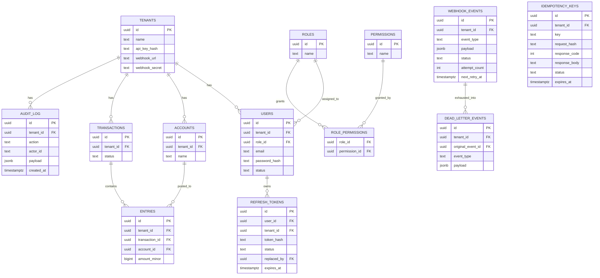

# Architecture

## Folder layout

```
cmd/api/                    main.go (bootstrap, DI, routing), handlers.go
internal/
  audit/                    immutable audit trail: repository + models
  auth/                     JWT issuing/validation, refresh token rotation, RBAC, own audit hook
  config/                   environment-based config loader
  ledger/                   transaction engine: Account/Transaction/Entry/Money,
                             repository (raw SQL, row-locking), service (use cases),
                             event emission, audit hook
  metrics/                  Prometheus metric definitions + /metrics handler
  middleware/
    auth/                   JWT authentication + RBAC permission-check middleware
    idempotency/            idempotency guard middleware + fencing-token store
    logging/                structured request logging
    metrics/                HTTP request instrumentation middleware
    recovery/               panic recovery middleware
  queue/                    generic Postgres-backed job queue (claim/retry/dead-letter
                             mechanics) — internal/webhook configures one instance of
                             this against the webhook_events/dead_letter_events tables
  tenants/                  tenant API-key verification
  webhook/                  HTTP delivery, HMAC signing, backoff policy, worker pool —
                             built on internal/queue
migrations/                 versioned SQL, applied automatically by docker compose
docker/                     Dockerfile, docker-compose.yml, .env.example
scripts/create_tenant/      operator CLI: provision a tenant + its API key
docs/                       this file, API.md, adr/
```

### Dependency-direction rule

Core domain packages (`ledger`, `middleware/idempotency`) never import
outward-facing packages (`webhook`, `auth`, `audit`). Instead they define
a small interface for exactly the capability they need — `EventEnqueuer`
in `ledger/events.go`, `AuditRecorder` in `ledger/audit.go` and
`auth/audit.go` — and the outward-facing package's repository satisfies
it *structurally* (Go's implicit interface satisfaction), with no import
in that direction at all. `webhook.Repository.EnqueueEvent` and
`audit.Repository.RecordAudit` are the concrete methods; `ledger` and
`auth` never `import ".../internal/webhook"` or `".../internal/audit"`.

This is deliberate and load-bearing, not incidental: it's what lets
`ledger.Service` and `auth.Service` be unit-tested (`service_test.go`)
with a fake in-process implementation of `EventEnqueuer`/`AuditRecorder`
instead of a real database, and it keeps the transaction engine
reusable outside any particular delivery/audit backend.

### A note on `internal/ledger`'s `Account` type

The Cahier des Charges' folder sketch lists both a `ledger/` package
("domain types: Transaction, Entry, Account, Money") *and* a separate
top-level `accounts/` package ("account management"). In this
implementation, `Account` stays inside `ledger` per the former note: an
account's balance is `SUM(entries WHERE status = 'posted')`, computed
under the same row lock (`FOR UPDATE`) taken during a transfer — see
`Repository.LockAccountsForUpdate` — so account reads and writes are not
actually separable from the transaction engine's own locking without
either duplicating that query or accepting a second round trip inside
an already-locked transaction. Splitting `CreateAccount`/`GetAccount`
into a standalone package while leaving balance computation in `ledger`
would add an abstraction boundary without a corresponding gain in
isolation.

### `internal/queue`

Originally webhook delivery had its own repository methods for
claim/retry/dead-letter mechanics. That storage layer has since been
factored out into `internal/queue` as a small generic Postgres-backed
job queue (`Enqueue`, `ClaimPending` with `FOR UPDATE SKIP LOCKED`,
`MarkDelivered`, `ScheduleRetry`, `MoveToDeadLetter`), parameterized by
table name pair at construction time. `internal/webhook` is the only
current caller — it configures one `queue.Repository` against
`webhook_events`/`dead_letter_events` and layers HTTP delivery, HMAC
signing, and backoff policy on top — but a second outbox-shaped queue
(e.g. a future notification channel) could reuse it against its own
table pair rather than re-implementing claim/retry/dead-letter logic.
`webhook.Repository`'s public method signatures are unchanged by this
factoring, so nothing outside `internal/webhook` needed to change.

## Entity-relationship diagram



`tenant_id` is present on every tenant-scoped table and every query
against it filters on `tenant_id` — see ADR-0004.

`idempotency_keys.response_body` is `TEXT`, not `JSONB` — see
`migrations/000007_idempotency_response_body_text.up.sql`: Postgres
canonicalizes `JSONB` on write (re-serializes it with its own
whitespace), which silently breaks byte-exact response replay.

## Runtime shape

`cmd/api/main.go` wires one process: an HTTP server (chi router) and a
background webhook-delivery worker goroutine, sharing one `*sql.DB`
connection pool. Middleware order on every route (`RequestID` →
`logging` → `metrics` → `recovery` → `Timeout`) is pinned by
`internal/middleware/logging/logging_test.go`'s
`TestMiddleware_MountedBeforeRecoverer_LogsActualRecoveredStatus`:
`recovery` must sit closer to the handler than `logging`, so that when
`recovery` writes a 500 for a panicking handler, `logging`'s status
recorder observes that recovered status instead of an unwritten zero
value.

Graceful shutdown on `SIGINT`/`SIGTERM` stops the webhook worker first
(no new delivery attempts start mid-shutdown), then drains the HTTP
server with a 10s timeout.
